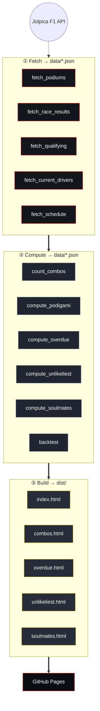
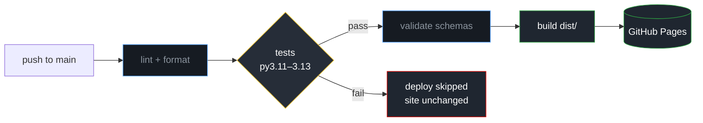

<div align="center">

# 🏁 F1 Podigami

### A scorigami-style predictor for Formula 1 podiums — *which trio of drivers will share a podium for the very first time next?*

Turns **76 years** of F1 race data (1950–2026) into a fast, framework-free static site.
No server. No database. No JavaScript framework. Just Python, one `requests` dependency, and vanilla JS.

<br>

[](https://github.com/NikoKiru/f1podigami/actions/workflows/ci.yml)
[](https://github.com/NikoKiru/f1podigami/actions/workflows/codeql.yml)
[](https://github.com/NikoKiru/f1podigami/actions/workflows/security.yml)
[](https://github.com/NikoKiru/f1podigami/actions/workflows/deploy.yml)
[](https://nikokiru.github.io/f1podigami/)

[](https://www.python.org/)
[](tests/)
[](pyproject.toml)
[](https://github.com/astral-sh/ruff)
[](https://api.jolpi.ca)
[](https://nikokiru.github.io/f1podigami/)

**[🔮 Live demo →](https://nikokiru.github.io/f1podigami/)**

</div>

---

## ✨ Features

- 🔮 **Podigami predictor** — ranks the never-before podium trios most likely to debut next, with a scorigami-style *"% chance the next race is brand-new"*.
- 🧮 **Backtested model** — the algorithm was *chosen by data*, not guesswork (see [the model](#-how-the-predictor-works)).
- 🏁 **Next race + last race** — countdown to the upcoming GP, plus a compact recap of the last race's podium trio with its podigami status and linked history.
- 🗓️ **Season timeline** — drag a year slider to see every trio that debuted on a podium in each season since 1950.
- ⏳ **Overdue trios** — driver pairs whose individual form says they *should* share a podium, but haven't yet.
- 🎲 **Unlikeliest podiums** — the mirror of Overdue: trios that *did* happen despite the odds, ranked by how big a fluke they were.
- 🤝 **Soulmates** — the shared-podium matrix showing which drivers have stood on the box together most.
- 🔗 **Cited sources** — every race links to its official Formula 1 result page, with a Wikipedia fallback.
- 📊 **Combinations table** — every unique 3-driver podium combination since 1950, sortable and filterable.
- 📱 **Mobile-first** — fully responsive, dark theme, locked in by CSS regression tests.
- ⚙️ **Zero-ops deploy** — rebuilds from committed JSON in CI; a guarded 15-minute poll auto-opens and merges a data-refresh PR after each race, which ships straight to GitHub Pages.

---

## 🏎️ Pages

| | Page | What it shows |
|---|---|---|
| 🔮 | **`index.html`** | The **Podigami predictor** — next/last race (with the upcoming qualifying time), most likely brand-new trio and candidate rankings that **refresh after qualifying using the starting grid** (with a collapsible current-form tower), season debut timeline (with quick-pick season chips), FAQ, plus live-stat discovery hooks and a "Keep exploring" grid routing to every other page |
| 🧩 | `combos.html` | Every unique three-driver combination that has shared a podium since 1950 — sortable, filterable, expandable |
| ⏳ | `overdue.html` | Trios "overdue" to appear — driver pairs whose current form suggests a shared podium is imminent |
| 🎲 | `unlikeliest.html` | The mirror of Overdue — podium trios that *did* happen ranked by how statistically improbable they were, led by the single biggest fluke in F1 history |
| 🤝 | `soulmates.html` | Shared-podium matrix — which drivers have stood on the box together most often |

---

## 🔮 How the predictor works


-e10600?style=flat-square)


A *podigami* = a 3-driver podium **set** that has **never** finished a podium together before.

The predictor is a **dynamic Bayesian rating engine** ([`src/compute/model_v2.py`](src/compute/model_v2.py)):

- **Pace** — every driver *and* every car carries a Gaussian rating (mean + uncertainty) over its log-worth. Each qualifying session and race classification since 1950 updates both with a closed-form truncated **Plackett–Luce** step; team lineage carries ratings across rebrands (Toro Rosso → AlphaTauri → RB, Jordan → … → Aston Martin).
- **Time** — ratings diffuse a little every race, more over a winter, a lot for cars when the technical regulations reset (2009, 2014, 2022, 2026…).
- **Survival** — exponentially-decayed DNF hazards, era-relative: mechanical failures charge the car, incidents charge the driver.
- **Chaos** — each circuit's grid→finish shuffle and DNF propensity adjust the prediction temperature and finish odds.
- **Grid** — once a race's qualifying is classified, the grid order feeds back through the ratings and a **circuit-modulated track-position term** shifts each driver's finishing odds — amplified at processional circuits where the grid rarely reshuffles, damped where it does — so the headline refreshes after qualifying. Known grid penalties (hand-curated in `data/grid_penalties.json`: place drops and back-of-grid starts) rebuild the actual starting slots for this term, while the qualifying order itself still counts at face value — a penalised driver demonstrated that pace regardless of where they start.
- **Prediction** — the engine simulates the next race (deterministic seed): skill noise + who survives, with *exact* conditional Plackett–Luce trio probabilities per draw. `P(next race is new)` is the exact complement of every already-seen trio.

> **Why this model?** Walk-forward evaluation — tuned on 2010–2018 only, then scored once on a frozen 2019–2026 test window (161 races) it never saw:
>
> | model | top-1 | top-3 | top-5 | log-loss |
> |---|---|---|---|---|
> | recency Plackett–Luce (previous) | 12.4% | 29.2% | 41.0% | 4.109 |
> | **rating engine (live, pre-qualifying)** | **18.0%** | **35.4%** | **44.1%** | **3.913** |
> | + qualifying order (post-qualifying) | 21.1% | 36.6% | 47.8% | 3.749 |
> | **+ grid position (post-qualifying)** | **25.5%** | **40.4%** | **51.5%** | **3.474** |
>
> Ablations: pace + reliability alone already beat v1; adding the qualifying order gave the biggest jump; a failure-order (attrition) channel earned zero weight and is off. Once a race's qualifying is in, replaying the grid order through the ratings **plus** a circuit-aware grid-position term (gate-accepted on the same hold-out) lifts top-3 to 40.4% and log-loss to 3.474. Full ladder in [`data/model_eval.json`](data/model_eval.json).

---

## 🧱 Architecture

A three-stage pipeline: **fetch → compute → build**. Each stage reads committed JSON and writes the next.



All access to `data/*.json` goes through **`src/datalib/`** — Pydantic v2 schemas that validate every read and write. `load_*` returns typed model objects; `save_*` validates the payload and writes its canonical schema form — byte-identical to a load/dump round-trip, so regenerating never reformats committed data.

<details>
<summary>📁 <strong>Repository layout</strong></summary>

```text
src/
  fetch/        API fetchers              → data/*.json
  compute/      aggregation / modelling   → data/*.json
  build/        page renderers            → dist/*.html
  datalib/      Pydantic schemas + typed load/save (the data contract)
  build_site.py     render all pages + copy assets → dist/
  update.py         refresh data, then build
assets/         source CSS + JS (copied into dist/ at build time)
data/           committed JSON datasets the site builds from
dist/           generated, deployable site (git-ignored)
tests/          pytest suite (555 tests, run in CI)
```

</details>

---

## 🚀 Quick start

```bash
# 1 · create + activate a virtual environment
python -m venv .venv
.venv\Scripts\activate         # Windows
source .venv/bin/activate      # macOS / Linux

# 2 · install dependencies
pip install -r requirements.txt

# 3 · build the site from the committed data (no network needed)
python src/build_site.py
#    → open dist/index.html
```

---

## 🛠️ Usage

| Command | When | What it does |
|---|---|---|
| `python src/build_site.py` | Anytime (offline) | Re-render all pages from committed data → `dist/` |
| `python src/update.py` | After each race | Incrementally fetch new podiums, classifications, qualifying + grid, recompute, rebuild |
| `python src/update.py --full` | First run / full rebuild | Re-fetch the entire race history from 1950 (slow), then rebuild |
| `PYTHONPATH=src python -m datalib.validate` | After editing data | Validate every dataset against its Pydantic schema |

---

## 🧪 Tests & CI

```bash
pip install -r requirements-dev.txt   # tooling: ruff, pytest-cov, pip-audit
ruff check . && ruff format --check .  # lint + format
pytest --cov                          # 555 tests + coverage gate (≥70%)
```

The suite covers **pure helpers**, **cross-dataset integrity** (combos derive from podiums, podigami
from combos + grid…), **build determinism & link resolution**, **mobile-CSS regressions**, **schema
fidelity** (byte-identical load/save round-trips), and the **prediction model** (including edge cases
and backtesting).

Every push and PR runs a hardened pipeline:

| Workflow | What it enforces |
|---|---|
| [`ci.yml`](.github/workflows/ci.yml) | **Lint & format** (Ruff) · **tests** on Python 3.11 / 3.12 / 3.13 with a **coverage gate** · **build** + offline **link-check** of the generated HTML |
| [`codeql.yml`](.github/workflows/codeql.yml) | **CodeQL** static analysis of Python *and* the workflow files (weekly + on PRs) |
| [`security.yml`](.github/workflows/security.yml) | **pip-audit** for vulnerable dependencies · **gitleaks** secret scanning |
| [`deploy.yml`](.github/workflows/deploy.yml) | Test-gated publish to **GitHub Pages** |
| [`update.yml`](.github/workflows/update.yml) | Guarded **data refresh** — polls every 15 min for a newly-finished race *or* a just-completed qualifying session (90-min buffer, to publish the post-qualifying prediction update), opens an auto-merging PR when due; a weekly run forces a full reconciliation |
| [`dependabot.yml`](.github/dependabot.yml) + [auto-merge](.github/workflows/dependabot-automerge.yml) | Weekly dependency PRs; patch/minor bumps auto-merge once CI is green |

All workflows run with **least-privilege permissions**, **concurrency cancellation**, and **pip
caching**. Quality settings live in [`pyproject.toml`](pyproject.toml).

---

## ☁️ Deployment

[`.github/workflows/deploy.yml`](.github/workflows/deploy.yml) builds `dist/` and publishes it to
**GitHub Pages** on every push to `main` — **but only if the test suite passes first.** A failing
test fails the build job, so the deploy step is skipped and the live site stays on the last good build.



> **One-time setup:** *Settings → Pages → Build and deployment → Source: **GitHub Actions***.

---

## 🗂️ File map

| Script | Role |
|---|---|
| **Fetch** | |
| `src/fetch/fetch_podiums.py` | Fetch P1/P2/P3 for every race → `data/podiums.json` |
| `src/fetch/fetch_race_results.py` | Fetch full race classifications (grid, laps, status) → `data/race_results.json` |
| `src/fetch/fetch_qualifying.py` | Fetch qualifying session order (1994→) → `data/qualifying.json` |
| `src/fetch/fetch_current_drivers.py` | Fetch the current racing grid → `data/current_drivers.json` |
| `src/fetch/fetch_schedule.py` | Fetch race calendar + circuit track outlines → `data/schedule.json` |
| `src/fetch/fetch_constructor_standings.py` | Fetch constructor championship standings → `data/constructor_standings.json` |
| `src/fetch/fetch_driver_races.py` | Fetch per-driver race participation → `data/driver_races.json` |
| `src/fetch/track_geo.py` | Resolve circuit SVG track paths from geo data |
| **Compute** | |
| `src/compute/count_combos.py` | Aggregate podiums into unique trios → `data/combos.json` |
| `src/compute/compute_podigami.py` | 🔮 Predict the next brand-new trio → `data/podigami.json` |
| `src/compute/compute_overdue.py` | Find trios overdue based on driver form → `data/overdue.json` |
| `src/compute/compute_unlikeliest.py` | Rank podium trios that happened despite the odds → `data/unlikeliest.json` |
| `src/compute/compute_soulmates.py` | Shared-podium matrix for the top 40 → `data/soulmates.json` |
| `src/compute/model.py` | Plackett–Luce strength model core (v1, fallback) |
| `src/compute/model_v2.py` | 🔮 Dynamic Bayesian rating engine (pace + reliability + chaos + simulation) |
| `src/compute/backtest.py` | Walk-forward ladder + tuners across hold-out seasons → `data/model_eval.json` |
| `src/compute/metrics.py` | Scoring metrics for model evaluation |
| **Build** | |
| `src/build/build_podigami_html.py` | Render `dist/index.html` (the predictor + next/last race) |
| `src/build/build_combos_html.py` | Render `dist/combos.html` |
| `src/build/build_overdue_html.py` | Render `dist/overdue.html` |
| `src/build/build_unlikeliest.py` | Render `dist/unlikeliest.html` |
| `src/build/build_soulmates_html.py` | Render `dist/soulmates.html` |
| `src/build/build_404_html.py` | Render `dist/404.html` |
| `src/build/_layout.py` | Shared page chrome: `head()`, `nav()`, footer |
| `src/build/flags.py` | Country flag SVGs |
| `src/build/team_colors.py` | Constructor colour lookup + contrast-safe text colour |
| **Data layer** | |
| `src/datalib/schemas.py` | Pydantic v2 schemas for every `data/*.json` |
| `src/datalib/repository.py` | Typed `load_*` / `save_*` functions |
| `src/datalib/validate.py` | CLI validator: `python -m datalib.validate` |
| **Orchestrators** | |
| `src/build_site.py` | Build `dist/` (render all pages + copy assets) |
| `src/update.py` | Refresh data, then build the site |

---

## 📡 Data source

All race data comes from the **[Jolpica F1 API](https://api.jolpi.ca)** — an Ergast-compatible
endpoint, no API key required. Race reports link to the **official Formula 1** result pages (with a Wikipedia fallback for any race not yet mapped).

<div align="center">
<sub>Includes the Indy 500 (1950–1960) · excludes Sprint races · predictions are for fun, not betting 🏎️</sub>
</div>
