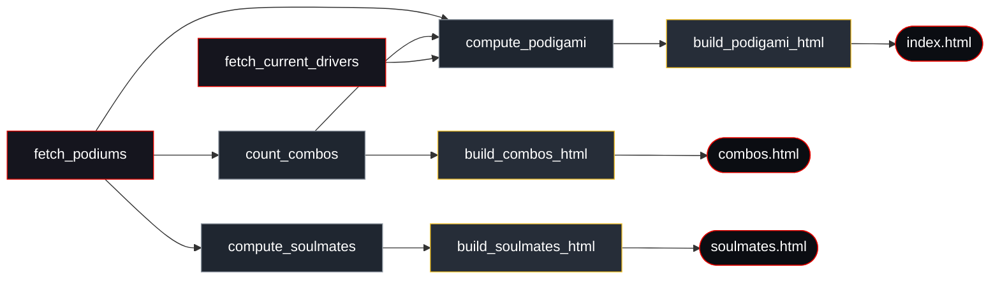
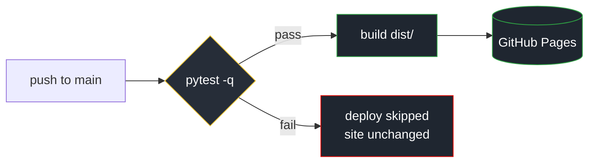

<div align="center">

# 🏁 F1 Podigami

### A scorigami-style predictor for Formula 1 podiums — *which trio of drivers will share a podium for the very first time next?*

Turns **76 years** of F1 race data (1950–2026) into a fast, framework-free static site.
No server. No database. No JavaScript framework. Just Python, one `requests` dependency, and vanilla JS.

<br>

[](https://github.com/NikoKiru/f1podigami/actions/workflows/ci.yml)
[](https://github.com/NikoKiru/f1podigami/actions/workflows/codeql.yml)
[](https://github.com/NikoKiru/f1podigami/actions/workflows/security.yml)
[](https://github.com/NikoKiru/f1podigami/actions/workflows/deploy.yml)
[](https://nikokiru.github.io/f1podigami/)

[](https://www.python.org/)
[](tests/)
[](pyproject.toml)
[](https://github.com/astral-sh/ruff)
[](https://api.jolpi.ca)
[](https://nikokiru.github.io/f1podigami/)

**[🔮 Live demo →](https://nikokiru.github.io/f1podigami/)**

</div>

---

## ✨ Features

- 🔮 **Podigami predictor** — ranks the never-before podium trios most likely to debut next, with a scorigami-style *"% chance the next race is brand-new"*.
- 🧮 **Backtested model** — the algorithm was *chosen by data*, not guesswork (see [the model](#-how-the-predictor-works)).
- 🗓️ **Season timeline** — drag a year slider to see every trio that debuted on a podium in each season since 1950.
- 🔗 **Cited sources** — every race links to its Wikipedia race report.
- 📊 **Two more views** — the full combinations table and a soulmates heatmap of the most-paired drivers.
- 📱 **Mobile-first** — fully responsive, dark theme, locked in by CSS regression tests.
- ⚙️ **Zero-ops deploy** — rebuilds from committed JSON in CI and ships to GitHub Pages on every push.

---

## 🏎️ Pages

| | Page | What it shows |
|---|---|---|
| 🔮 | **`index.html`** | The **Podigami predictor** — most likely next brand-new podium trio + the season debut timeline |
| 🧩 | `combos.html` | Every unique three-driver combination that has shared a podium since 1950 (order-independent) |
| 💞 | `soulmates.html` | A symmetric heatmap of the 40 most decorated drivers — who shared the most podiums, clustered by era |

> 📈 Career charts and season-alignment analysis live in a sibling repo, [`f1_seasons_charts`](../f1_seasons_charts).

---

## 🔮 How the predictor works


A *podigami* = a 3-driver podium **set** that has **never** finished a podium together before.

For each driver on the current grid:

```
weight(d) = α  +  Σ over past podiums of 0.5 ^ (races_ago / H)  +  boost · (podiums this season)
            └ floor ┘   └──────── recency decay (half-life H) ────────┘   └── current-season nudge ──┘
```

The score of a trio is the product of its three weights, normalised over **every** trio on the grid.
`P(next race is new)` is the share of that mass sitting on trios that have never happened.

> **Why this formula?** It was picked by backtesting candidate models over 1950–2026 (333 race hold-outs):
> - 📉 Cumulative **career** counts barely beat random (top-1 ≈ 2%) — longevity ≠ current form.
> - 📈 **Recency** (exponential decay, half-life ≈ 8 races) jumped to **top-1 ≈ 13%, top-5 ≈ 41%**.
> - ➕ A *mild* current-season boost helped; blending career rate back in **hurt**, so it was dropped.
>
> Tunable constants live in [`src/compute/compute_podigami.py`](src/compute/compute_podigami.py).

---

## 🧱 Architecture

Each stage reads committed JSON and writes the next — **fetch → compute → build → pages**:



<details>
<summary>📁 <strong>Repository layout</strong></summary>

```text
src/
  fetch/      API fetchers          → data/*.json
  compute/    aggregation / model   → data/*.json
  build/      page renderers        → dist/*.html
  build_site.py   render all pages + copy assets → dist/
  update.py       refresh data, then build
assets/       source CSS + JS (copied into dist/ at build time)
data/         committed JSON datasets the site builds from
dist/         generated, deployable site (git-ignored)
tests/        pytest suite (107 tests, run in CI)
```

</details>

---

## 🚀 Quick start

```bash
# 1 · create + activate a virtual environment
python -m venv .venv
.venv\Scripts\activate         # Windows
source .venv/bin/activate      # macOS / Linux

# 2 · install dependencies
pip install -r requirements.txt

# 3 · build the site from the committed data (no network needed)
python src/build_site.py
#    → open dist/index.html
```

---

## 🛠️ Usage

| Command | When | What it does |
|---|---|---|
| `python src/build_site.py` | Anytime (offline) | Re-render all pages from committed data → `dist/` |
| `python src/update.py` | After each race | Incrementally fetch new podiums + grid, recompute, rebuild |
| `python src/update.py --full` | First run / full rebuild | Re-fetch the entire podium history from 1950 (slow), then rebuild |

---

## 🧪 Tests & CI

```bash
pip install -r requirements-dev.txt   # tooling: ruff, pytest-cov, pip-audit
ruff check . && ruff format --check .  # lint + format
pytest --cov                          # 107 tests + coverage gate (≥70%)
```

The suite covers **pure helpers**, **cross-dataset integrity** (combos derive from podiums, podigami
from combos + grid…), **build determinism & link resolution**, **mobile-CSS regressions**, and the
**prediction model** (including edge cases).

Every push and PR runs a hardened pipeline:

| Workflow | What it enforces |
|---|---|
| [`ci.yml`](.github/workflows/ci.yml) | **Lint & format** (Ruff) · **tests** on Python 3.11 / 3.12 / 3.13 with a **coverage gate** · **build** + offline **link-check** of the generated HTML |
| [`codeql.yml`](.github/workflows/codeql.yml) | **CodeQL** static analysis of Python *and* the workflow files (weekly + on PRs) |
| [`security.yml`](.github/workflows/security.yml) | **pip-audit** for vulnerable dependencies · **gitleaks** secret scanning |
| [`deploy.yml`](.github/workflows/deploy.yml) | Test-gated publish to **GitHub Pages** |
| [`update.yml`](.github/workflows/update.yml) | Scheduled weekly **data refresh** (auto-commits new race results) |
| [`dependabot.yml`](.github/dependabot.yml) + [auto-merge](.github/workflows/dependabot-automerge.yml) | Weekly dependency PRs; patch/minor bumps auto-merge once CI is green |

All workflows run with **least-privilege permissions**, **concurrency cancellation**, and **pip
caching**. Quality settings live in [`pyproject.toml`](pyproject.toml).

---

## ☁️ Deployment

[`.github/workflows/deploy.yml`](.github/workflows/deploy.yml) builds `dist/` and publishes it to
**GitHub Pages** on every push to `main` — **but only if the test suite passes first.** A failing
test fails the build job, so the deploy step is skipped and the live site stays on the last good build.



> **One-time setup:** *Settings → Pages → Build and deployment → Source: **GitHub Actions***.

---

## 🗂️ File map

| Script | Role |
|---|---|
| `src/fetch/fetch_podiums.py` | Fetch P1/P2/P3 for every race → `data/podiums.json` |
| `src/fetch/fetch_current_drivers.py` | Fetch the current racing grid → `data/current_drivers.json` |
| `src/compute/count_combos.py` | Aggregate podiums into unique trios → `data/combos.json` |
| `src/compute/compute_podigami.py` | 🔮 Predict the next brand-new trio → `data/podigami.json` |
| `src/compute/compute_soulmates.py` | Shared-podium matrix for the top 40 → `data/soulmates.json` |
| `src/build/build_podigami_html.py` | Render `dist/index.html` (the predictor) |
| `src/build/build_combos_html.py` | Render `dist/combos.html` |
| `src/build/build_soulmates_html.py` | Render `dist/soulmates.html` |
| `src/build_site.py` | Build `dist/` (render all pages + copy assets) |
| `src/update.py` | Refresh data, then build the site |

---

## 📡 Data source

All race data comes from the **[Jolpica F1 API](https://api.jolpi.ca)** — an Ergast-compatible
endpoint, no API key required. Race reports link to **Wikipedia**, the same source the API cites.

<div align="center">
<sub>Includes the Indy 500 (1950–1960) · excludes Sprint races · predictions are for fun, not betting 🏎️</sub>
</div>
